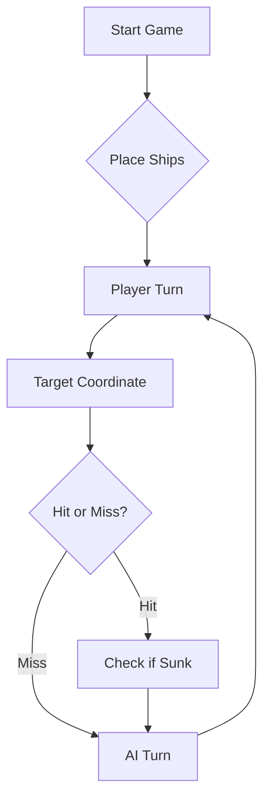

# ⚓ Battleship 2.0


> A modern take on the classic naval warfare game, designed for the XVII century setting with updated software engineering patterns.

---

## 📖 Table of Contents
- [Project Overview](#-project-overview)
- [Key Features](#-key-features)
- [Technical Stack](#-technical-stack)
- [Installation & Setup](#-installation--setup)
- [Code Architecture](#-code-architecture)
- [Roadmap](#-roadmap)
- [Contributing](#-contributing)

---

## 🎯 Project Overview
This project serves as a template and reference for students learning **Object-Oriented Programming (OOP)** and **Software Quality**. It simulates a battleship environment where players must strategically place ships and sink the enemy fleet.

### 🎮 The Rules
The game is played on a grid (typically 10x10). The coordinate system is defined as:

$$(x, y) \in \{0, \dots, 9\} \times \{0, \dots, 9\}$$

Hits are calculated based on the intersection of the shot vector and the ship's bounding box.

---

## ✨ Key Features
| Feature | Description | Status |
| :--- | :--- | :---: |
| **Grid System** | Flexible $N \times N$ board generation. | ✅ |
| **Ship Varieties** | Galleons, Frigates, and Brigantines (XVII Century theme). | ✅ |
| **AI Opponent** | Heuristic-based targeting system. | 🚧 |
| **Network Play** | Socket-based multiplayer. | ❌ |

---

## 🛠 Technical Stack
* **Language:** Java 17
* **Build Tool:** Maven / Gradle
* **Testing:** JUnit 5
* **Logging:** Log4j2

---

## 🚀 Installation & Setup

### Prerequisites
* JDK 17 or higher
* Git

### Step-by-Step
1. **Clone the repository:**
   ```bash
   git clone [https://github.com/britoeabreu/Battleship2.git](https://github.com/britoeabreu/Battleship2.git)
   ```
2. **Navigate to directory:**
   ```bash
   cd Battleship2
   ```
3. **Compile and Run:**
   ```bash
   javac Main.java && java Main
   ```

---

## 📚 Documentation

You can access the generated Javadoc here:

👉 [Battleship2 API Documentation](https://britoeabreu.github.io/Battleship2/)


### Core Logic
```java
public class Ship {
    private String name;
    private int size;
    private boolean isSunk;

    // TODO: Implement damage logic
    public void hit() {
        // Implementation here
    }
}
```

### Design Patterns Used:
- **Strategy Pattern:** For different AI difficulty levels.
- **Observer Pattern:** To update the UI when a ship is hit.
</details>

### Logic Flow


---

## 🗺 Roadmap
- [x] Basic grid implementation
- [x] Ship placement validation
- [ ] Add sound effects (SFX)
- [ ] Implement "Fog of War" mechanic
- [ ] **Multiplayer Integration** (High Priority)

---

## 🧪 Testing
We use high-coverage unit testing to ensure game stability. Run tests using:
```bash
mvn test
```

> [!TIP]
> Use the `-Dtest=ClassName` flag to run specific test suites during development.

---

## 🤝 Contributing
Contributions are what make the open-source community such an amazing place to learn, inspire, and create.

1. Fork the Project
2. Create your Feature Branch (`git checkout -b feature/AmazingFeature`)
3. Commit your Changes (`git commit -m 'Add some AmazingFeature'`)
4. Push to the Branch (`git push origin feature/AmazingFeature`)
5. Open a **Pull Request**

---

## 📄 License
Distributed under the MIT License. See `LICENSE` for more information.

---
**Maintained by:** [@britoeabreu](https://github.com/britoeabreu)  
*Created for the Software Engineering students at ISCTE-IUL.*

---
## 🧠 Estratégia do Oponente de IA (LLM)

Esta secção documenta o treino do LLM (Gemini) para jogar Battleship como oponente, no âmbito das Tarefas C e D da Ficha Laboratorial nº2.

### Objetivo

Treinar um LLM para jogar Battleship na versão dos Descobrimentos Portugueses, comunicando através de mensagens JSON, e aplicar a técnica de **few-shot prompting** para melhorar a sua estratégia de jogo.

### Protocolo de Comunicação JSON

A interação é feita através de rajadas de 3 tiros e respostas em JSON.

**Rajada (input):**

```json
[
  {"row": "D", "column": 2},
  {"row": "B", "column": 4},
  {"row": "G", "column": 1}
]
```

**Resposta (output):**

```
> rajada D2 B4 G1
Jogada n.5 -> 3 tiros validos: 2 Barcas ao fundo + 1 Fragata ao fundo
{
  "validShots" : 3,
  "sunkBoats" : [ {
    "count" : 2,
    "type" : "Barca"
  }, {
    "count" : 1,
    "type" : "Fragata"
  } ],
  "repeatedShots" : 0,
  "outsideShots" : 0,
  "hitsOnBoats" : [ ],
  "missedShots" : 0
}

[ {
  "row" : "D",
  "column" : 2
}, {
  "row" : "B",
  "column" : 4
}, {
  "row" : "G",
  "column" : 1
} ]

Estado da Frota: 6 a flutuar, 5 afundados!

     1 2 3 4 5 6 7 8 9 10
   +---------------------+
 A | - * - - - . . . . . |
 B | - * - * - . # # . # |
 C | - * o - - - - - . . |
 D | - * - - * * * - . . |
 E | - - - - - - - - . . |
 F | - - . . # - o - - - |
 G | * - # . . - * * * - |
 H | - - # . . - - - - - |
 I | . # # # o . # . # # |
 J | . . . . . . # . . . |
   +---------------------+

D2 (Fragata ao fundo), B4 (Barca ao fundo), G1 (Barca ao fundo)
```

### Prompt Inicial

Considere agora a seguinte tática de geração de rajadas de tiros.

- Crie um **Diário de Bordo** com o registo de cada rajada disparada, numerando-as sequencialmente (Rajada 1, 2, 3...). Guarde as coordenadas exatas de cada tiro e o respetivo resultado (Água, Nau atingida, Barca afundada, etc.). A memória é a principal arma de um bom estratega.

- Não dispare fora dos limites do mapa (ex: Z99) nem repita tiros em coordenadas já testadas. A única exceção para este desperdício de pólvora é a última rajada do jogo, apenas para perfazer os 3 tiros obrigatórios quando a frota inimiga já estiver irremediavelmente no fundo do mar.

- Se atingir um navio numa rajada, dispare nas posições contíguas (Norte, Sul, Este, Oeste) na jogada seguinte para descobrir a orientação da embarcação e acabar de a afundar. No entanto, se a rajada anterior confirmar que o navio já foi afundado, não dispare para as posições contíguas, pois os navios nunca estão encostados.

- Como as Caravelas, Naus e Fragatas são linhas retas, um tiro certeiro significa que o resto do navio está na horizontal ou na vertical. Como os navios não se podem tocar (nem sequer nos cantos), as posições diagonais a um tiro certeiro são garantidamente água (a única exceção é o corpo do Galeão, devido à sua forma em T). Evitar estas diagonais poupa imensos tiros.

- Quando o relatório de uma rajada confirmar que um navio foi afundado (ex: Fragata de 4 posições), analise os dados do seu Diário de Bordo para identificar exatamente onde caíram esses 4 tiros. Confirmada a posição exata da carcaça, marque todas as quadrículas adjacentes (o halo de 1 posição em redor do navio) como água intransitável. É impossível haver outra embarcação nesse perímetro.

- Se a sua frota for toda afundada, declare a derrota com honra. Em contrapartida, seja um vencedor magnânimo se for o inimigo a render-se com os navios todos no fundo do oceano!

### Aplicação de Few-Shot Prompting (Proativa)

Após validação do comportamento do LLM nas primeiras partidas, verificou-se que o Gemini já demonstrava uma estratégia sólida desde o início. Ainda assim, foi aplicada a técnica de **few-shot prompting** de forma proativa, adicionando exemplos de raciocínio ao prompt inicial, com o objetivo de:

- Reforçar o comportamento desejado;
- Documentar explicitamente a estratégia esperada;
- Garantir consistência ao longo das partidas.

#### Exemplo 1 — Raciocínio após uma rajada com acerto

**Rajada 1:** `[C4, C5, C6]`

**Resposta recebida:**

```json
{
  "validShots": 3,
  "sunkBoats": [],
  "repeatedShots": 0,
  "outsideShots": 0,
  "hitsOnBoats": [{"hits": 1, "type": "Nau"}],
  "missedShots": 2
}
```

**Diário de Bordo atualizado:**

- C5 atingiu uma Nau. Próxima rajada: atacar B5, D5, C4, C6.
- Marcar como água provável: B4, B6, D4, D6 (diagonais).

#### Exemplo 2 — Raciocínio após afundar um navio

**Rajada 2:** `[C4, D5, C6]`

**Resposta recebida:**

```json
{
  "validShots": 3,
  "sunkBoats": [{"count": 1, "type": "Nau"}],
  "repeatedShots": 0,
  "outsideShots": 0,
  "hitsOnBoats": [],
  "missedShots": 2
}
```

**Diário de Bordo atualizado:**

- Nau afundada em C4-C5-C6 (horizontal).
- Marcar halo de água intransitável: B3, B4, B5, B6, B7, C3, C7, D3, D4, D5, D6, D7.

### Observações

O LLM (Gemini) demonstrou desde o início um comportamento estratégico sólido, cumprindo naturalmente todas as regras do prompt:

- ✅ Evitou tiros fora do tabuleiro
- ✅ Evitou repetir tiros
- ✅ Atacou posições contíguas após acertos
- ✅ Marcou o halo de água à volta de navios afundados
- ✅ Manteve um Diário de Bordo coerente

Não foram necessárias correções ao comportamento do LLM durante as partidas. A técnica de few-shot prompting foi aplicada **proativamente**, com exemplos embutidos no prompt inicial.
